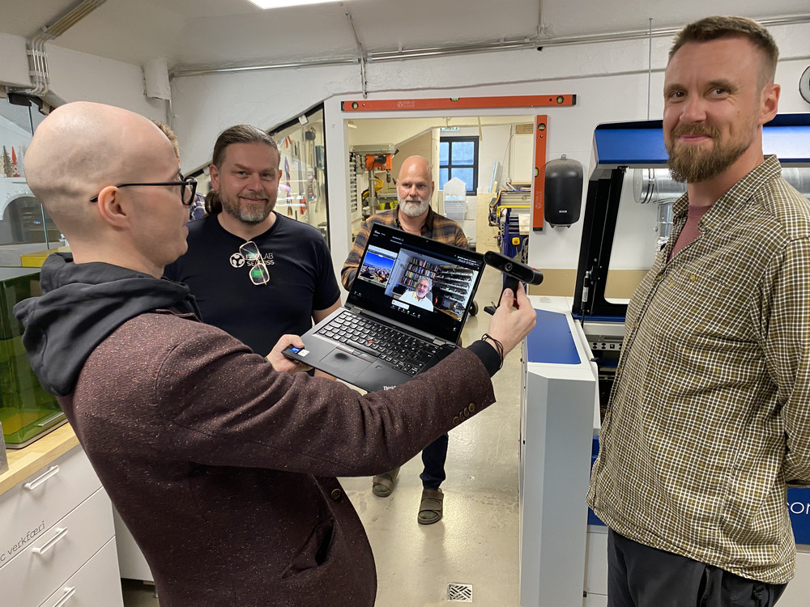

# Neil Gershenfeld heilsar upp á Fab Lab Ísland hópinn

Neil Gershenfeld heilsaði upp á hópinn í byrjun miðvikudagsfyrirlestrarins í Fab Academy. Þórarinn Bjartur Breiðfjörð tók að sér að sýna nemendum um allan heim inn í Fab Lab Húsavík og svara spurningum Neils um hvað væri verið að gera. Neil minnist á hverju ári á það að íslensku Fab Lab smiðjurnar séu einhver þéttasti hópur Fab Lab smiðja sem um getur; við hittumst vikulega á netinu og einu sinni á ári er haldið bootcamp í einni smiðjunni þar sem allir mæta á staðinn.

*Upptöku frá sýndarheimsókn Neils má sjá á fyrstu mínútunum í [þessu myndbandi](https://vimeo.com/1087090935).*

Fab Academy nemendurnir [Ólöf Hannesdóttir](https://fabacademy.org/2025/labs/isafjordur/students/olof-hannesdottir/about/) og [Magnús Pétursson](https://fabacademy.org/2025/labs/reykjavik/students/magnus-petursson/about/) tóku frá miðvikudaginn kl. 13 til að mæta á fyrirlestur Neil Gershenfeld, sem fjallaði um [applications and implications](https://academy.cba.mit.edu/classes/applications_implications/index.html) og [project development](https://academy.cba.mit.edu/classes/project_development/index.html). Nú er Fab Academy að klárast og nemendurnir eru að vinna að lokaverkefnunum sínum. 

<!-- more -->

Ólöf bjó til [listaverk](https://fabacademy.org/2025/labs/isafjordur/students/olof-hannesdottir/final-project/) sem lætur leið hvalsins á milli Íslands og Karíbahafsins lýsast upp. Ólöf lætur hvalinn sjálfan svífa yfir sjónum með rafsegli. 

<video controls width=100%>
        <source src="https://fabacademy.org/2025/labs/isafjordur/students/olof-hannesdottir/presentation.mp4" type="video/mp4">
</video>

Magnús bjó til [vél](https://fabacademy.org/2025/labs/reykjavik/students/magnus-petursson/projects/final-project/) sem notar mótora til að fletta Magic the Gathering spilum úr safni sínu, einu í einu og greina hvaða spil er um að ræða með tölvusjón. Þannig getur hann fengið yfirsýn yfir öll spilin, sem skipta tugum þúsunda.

<video controls width=100%>
        <source src="https://fabacademy.org/2025/labs/reykjavik/students/magnus-petursson/presentation.mp4" type="video/mp4">
</video>

