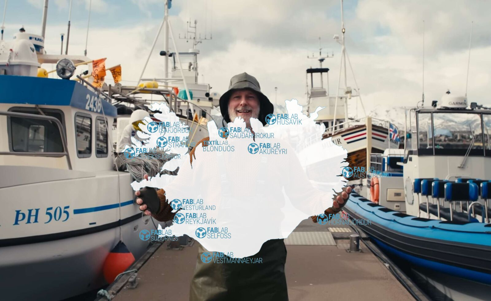

---
hide:
  - navigation
  - toc
  - path
---

# Bootcamp Húsavík 2025

{width=70%}
///caption
Stefán forstöðumaður fab Lab Húsavíkur býður ykkur velkomin!
///

## Bootcamp fyrri ára

📍 **[2024 – Selfoss](https://fab-lab-island.github.io/fli-bootcamp-2024/)**
📍 **[2023 – Neskaupstaður](https://fab-lab-island.github.io/fli-bootcamp-2023/)**  
📠**[2022 – Ãsafjörður]()** 
📠**[2021 – Höfn í Hornafirði]()** 
📠**[2020 – Akureyri]()** 
📠**[2019 – Vestmanneyjar]()** 
📠**[2018 – Sauðárkrókur]()** 

## Um Bootcamp

Árlega hittast allar Fab Lab smiðjur á Íslandi til að efla samstarf, miðla þekkingu og þróa nýjar hugmyndir. Við köllum það **Bootcamp**

[fablab.is](https://fablab.is/)
