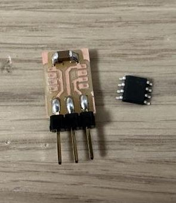
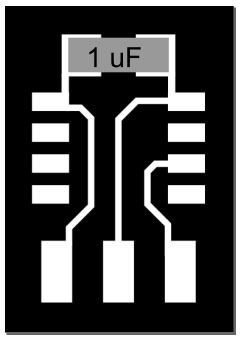
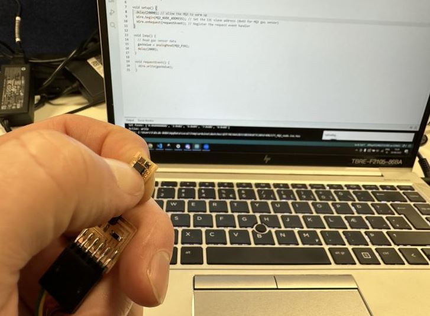
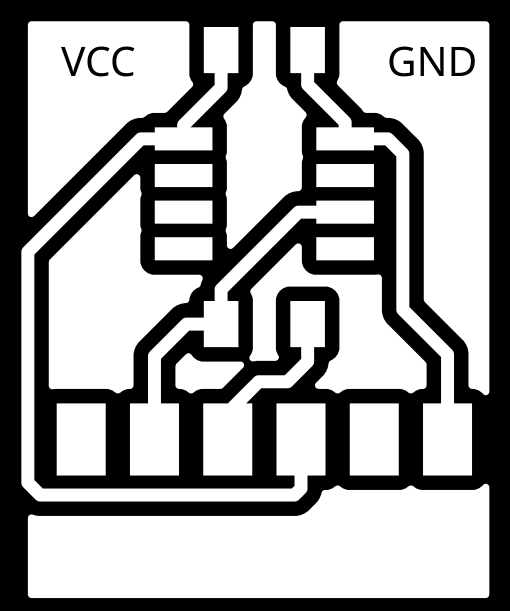

# ATtiny 412 Programmer Breakout Board

Þetta er lítið sniðugt bretti sem er hægt að nota til þess að forrita ATtiny 412 áður en hann er lóðaður á bretti.

Það er mjög sniðugt því þá þarf ekki að lóða sérstaklega forritunar-pinna á brettið sem ATtiny kubburinn á að vera á.

## ATtiny412 Breakout bretti

///caption
ATtiny412 Breakout Bretti
///

Brettið er ofur einfalt. Það er einn 1uF capacitor, fótspor fyrir ATtiny412 og þrír pinnar.

///caption
ATtiny412 Breakout Bretti íhlutir
///

## Serial-UPDI 3-pin millistykki

///caption
Serial-UPDI 3-pin millistykki
///

///caption
Serial-UPDI 3-pin millistykki
///

Hér er hægt að sækja skrárnar sem þarf til að fræsa út millistykkið

[Download Trace .png file](https://academy.cba.mit.edu/classes/embedded_programming/UPDI/hello.serial-UPDI.3.traces.png) 

[Download Cut .png file](https://academy.cba.mit.edu/classes/embedded_programming/UPDI/hello.serial-UPDI.3.interior.png) 

## Forrita ATtiny412

Til þess að forrita ATtiny412 þá þarf að halda kubbnum þétt upp að fótsporunum, (VCC og GND næst þéttinum), svo eru pinnunum þremur tengt í Serial-UPDI 3-pin millistykkið og millistykkið tengt til FTDI-USB snúru. Svo er ATtiny412 kubburinn forritaður í gegnum Arduino IDE.

///caption
ATtiny412 forritaður með breakout brettinu, Serial-UPDI millistykki og FTDI-USB snúru
///

## UPDATE !!!

### Millistykki innifalið

Í þessari útgáfu er millistykkið innifalið í brettinu svo það þarf bara að tengja þetta bretti beint í FTDI snúruna.

///caption
ATtiny412 breakout brettið með serial pinnum
///

[Download Trace .svg file](../assets/files/ATtinyBreakoutProgrammer/ATtiny412UPDI_Serial_Programmer-F_Cu.svg) 

///caption
ATtiny412 breakout brettið með serial pinnum sem hægt er að tengja beint í FTDI snúru
///