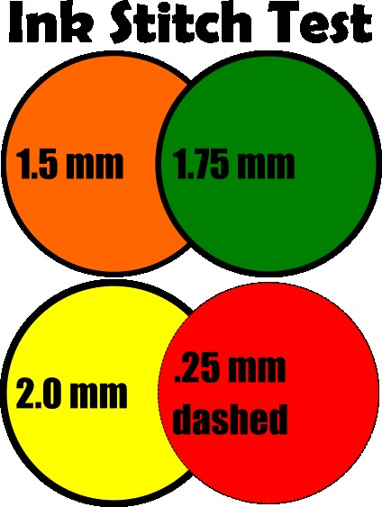
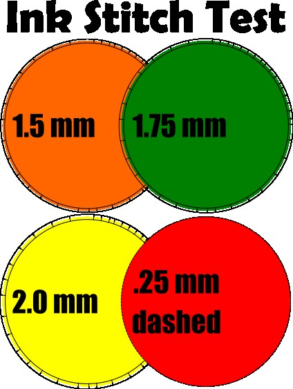
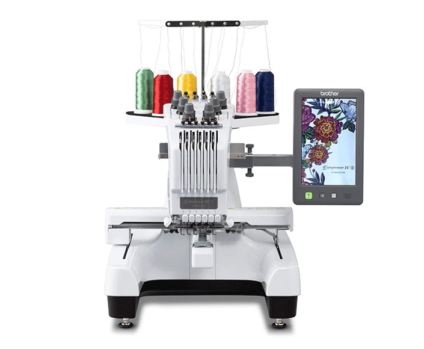
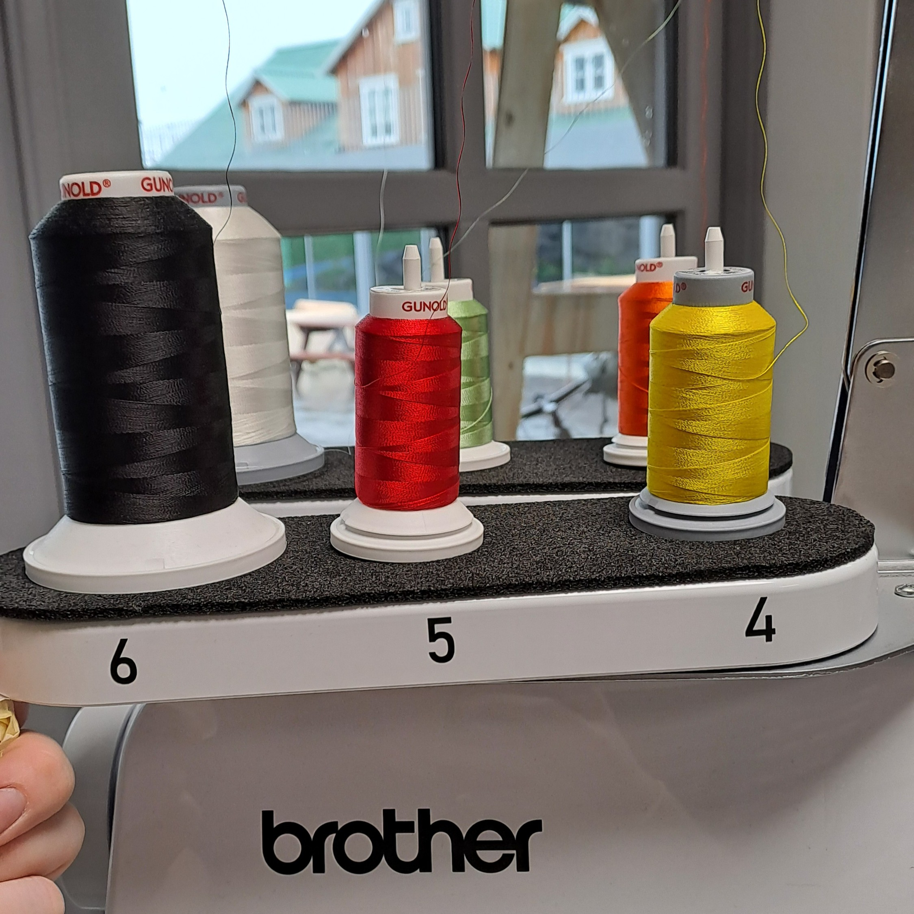

## Embroidery and Inkstitch

This page is dedicated to going over some of the embroidery techniques that were used in Húsavík.

[Inkstitch Install Link](https://inkstitch.org/docs/install/)

### Youtube tutorial for Inkstitch

These are the tutorials I watch to get used to using inkstitch. They cover the basics, but there is a lot that can be done with this program. The [Basic Tutorial](https://www.youtube.com/watch?v=W7u4mPaRjIs) teaches how to setup inkscape and inkstitch. It also covers how inkstitch work from a basic level. The [Fill Stitch Tutorial](https://www.youtube.com/watch?v=a3-qerPiJy4) covers how to do a fill stitch with Inkstitch and also the parameters. It also goes over the different type of fill stitch. The [Satin Stitch Tutorial](https://www.youtube.com/watch?v=Sqy_QTgPYH4) show you how to cover lines into satin stitch. It also talks about the parameters. 

### Inkstitch Basic Principles

- Inkstitch .pes file also build from the bottom up. The shape on the lowest on the layer will stitch first and the top object will stitch last. You can alway check how it will stitch by going to → **extensions > ink/stitch > visualize and export > simulator**

- Filled objects are fill stitch by default. 

- Dashed line are a single stitch.

- All texts need to be converted from object to stroke. Also, they sometimes need to be ungrouped. 
→ **path > object to path**

- The way to get satin stitch is to make a stroke on the object. Then convert it to satin.
→ **Extensions > Ink/Stitch > Tools: Satin > Convert Line to Satin**

- Satin line thickness should never be less than 1.5 mm, however 2.0 mm or more is the most ideal.

- Make sure to not save as a .pes file until you are finished with the design and save an .svg as well. It is not easy to open a .pes in inkscape after it has been closed. 

### Test File for Inkstitch

So this is an image of the file before converting the line (stroke) to satin. 
{loading=lazy}

→ **Extensions > Ink/Stitch > Tools: Satin > Convert Line to Satin**

This is the file after the conversion. 
{loading=lazy}

It is good to check you work before exporting as a .pes file by using the simulator. → **extensions > ink/stitch > visualize and export > simulator**

[Example of .pes file](../assets/files/embroidery/inkstitch_example.pes) and [Example of .svg file](../assets/files/embroidery/inkstitch_example.svg)

Try these out and let me know how the turn out. I think this is a good starter example to see how inkstitch works by building layer by layer. It also show the basic fill and satin parameters. 

To go further each object can have the parameters changed. → **extensions > ink/stitch > params**

### Improvements to the Machine and Ideas
They are using was a Brother PR680W 6-Needle embroidery machine. [Link to the machine.](https://sewingcraft.brother.eu/en/products/machines/semi-pro-embroidery-machines/semi-pro-embroidery-machines/pr680w)

{loading=lazy}

When using the machine I noticed that the tread area was not labeled. It is need to be able to quickly change trad colors and ensure the machine is treaded correctly. I just cut 1-6 out on the vinyl cutter and then added them to the machine. 

{loading=lazy}

