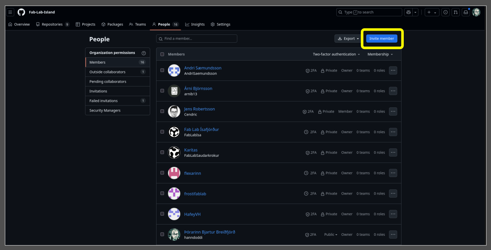
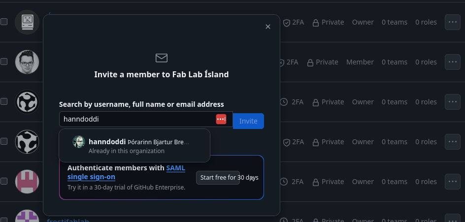

# Að bæta við notendum sem geta sett efni á síðuna

Til að einhver geti breytt síðunni þarf hann að vera bættur við sem notandi í [Fab Lab Ísland](https://github.com/orgs/Fab-Lab-Island/people) hópnum á GitHub.

Öll þau sem nú þegar eru í hópnum geta boðið öðrum í hópinn.

## Skref fyrir skref

1. Fáðu **notandanafn (username)** viðkomandi á GitHub.
2. Einn af núverandi meðlimum hópsins sendir **boð (invite)** í gegnum GitHub.
3. Viðkomandi fær tölvupóst og þarf að **samþykkja boðið**.
4. Þegar boðið hefur verið samþykkt getur hann breytt síðunni beint í gegnum GitHub.

> 💡 *Ef verið er að nota MkDocs Material með GitHub Pages, þá nægir oft að breyta skrám beint á GitHub í gegnum „Edit this file“ hnappinn ef notandi hefur aðgang.*

///caption
Hér er ýtt á invite uppi til hægri
///

///caption
Í þessum glugga er leitað að notanda og ýtt á invite
///
