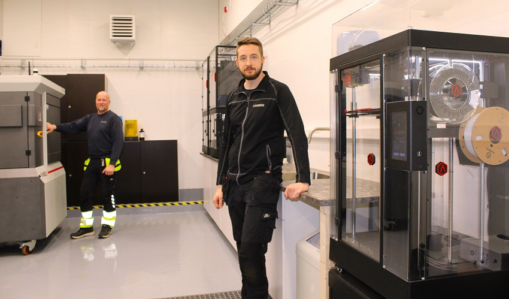
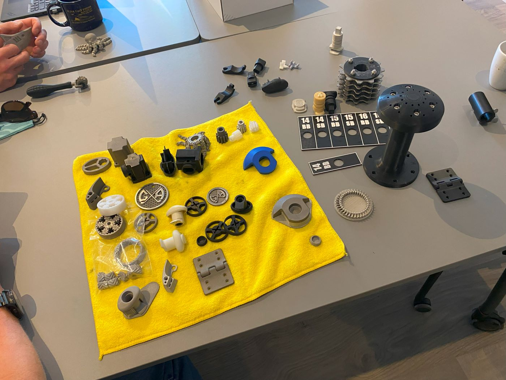

# N. Hansen kynning á málm 3D prentun

Arnór Ingi og Gunnar komu í heimsókn frá [N. Hansen](https://www.nhansen.is/3dprentun.html) og kynntu það sem þeir hafa verið að prófa þegar það kemur að því að þrívíddarprenta hluti úr málmi.

Plastþráðurinn er fylltur með málmögnum og eftir prentun er plastið leyst upp í sérstöku tæki. Þegar plastið er horfið eru stykkin gljúp og viðkvæm. Þau eru flutt varlega yfir í ofn og sinteruð. Þá skreppa stykkin saman um 20 prósent, loftbilin hverfa nánast alveg og málmagnirnar sameinast. Þannig fást mjög þéttir og sterkir málmhlutir. Málmprentun hentar best fyrir tiltölulega litla hluti sem eru flóknir í laginu og erfitt að fræsa. Það kom Fab Lab hópnum á óvart hversu fíngerða hluti er hægt að prenta úr stáli og hversu lítil verping verður á stykkjunum þegar þau eru sinteruð. Þetta er spennandi viðbót við flóruna á Íslandi.

<!-- more -->

