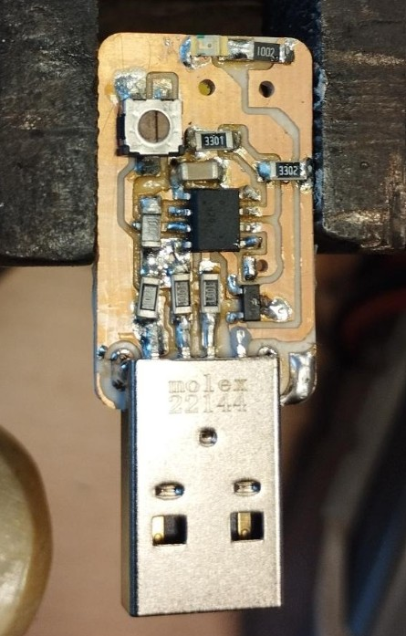
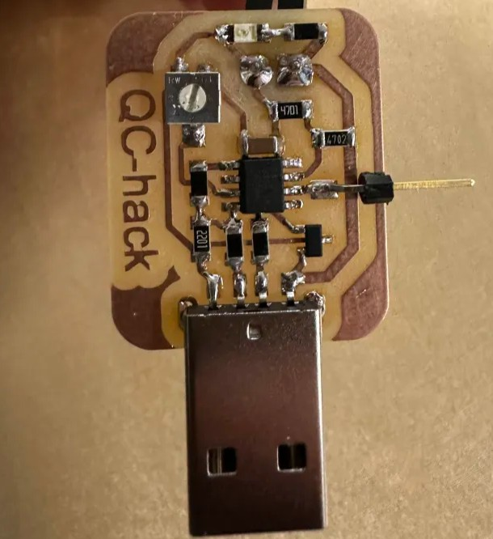

# QC-hack

# Quick Charge - Hack

## Fáðu (nánast) hvaða spennu með QC hleðslutæki - (3.6V - 20V)

### [Sjá upprunalegt documentation eftir Nicolas Decoster](https://fabacademy.org/2018/labs/fablabulb/students/nicolas-decoster/alumnus/projects/qc/){target=_blank}

"The QuickCharge protocol lets you “negotiate” voltage through USB on smart power supplies."
Lesið ítarlegt documentation eftir Nicolas til að vita meira um verkefnið

### QC-Hack Upprunalega brettið

/// caption
Upprunalega QC brettið
///

## QC Hack - Endurhönnun

Ég ákvað að "endurhanna" brettið hans Nicolas í KiCAD, bæði til að æfa mig í KiCAD og til þess að gera brettið aðeins skýrara. Brettið hans Nicolas notar fill til að tengja Ground en mig langaði að tengja allt með rásum. Brettið hans Nicolas notaði líka 5mm Screw Terminal en við áttum bara til 3.5mm Screw Terminal. Ég breytti líka aðeins pinnanum sem forritar í gegnum UPDI.

### QC-Hack Endurhannað bretti

/// caption
Endurhannað bretti
///

Pælingin á bakvið verkefnið er einföd, nota QuickCharge USB-! hleðslutæki til að fá spennu á brettið og annaðhvort í kóða eða með potentiometer er hægt að breyta spennu frá 3.6V upp í 20V. Þetta er mjög sniðugt fyrir verkefni sem þurfa meira en 5V spennu.

Það þarf að vanda valið á hleðslutæki. Verið viss um að Output í hleðslutækinu fari upp í 20V ef það er það sem verkefnið þitt þarf.

[Example 20V output current charger](https://nedis.com/en-us/product/computer-and-mobile/power-supply/usb-chargers/550783985/wall-charger-65-w-gan-pd30-18w-pd30-20w-pd30-27w-pd30-36w-pd30-45w-pd30-60w-pd30-65w-qc30-quick-charge-feature-30-325-a-number-of-outputs-3-usb-a-2x-usb-c-automatic-voltage-selection-black)
/// caption
Dæmi um 20 Output hleðslutæki
///

[Example 12V output current charger](https://nedis.com/en-us/product/computer-and-mobile/power-supply/usb-chargers/550732027/wall-charger-18-w-quick-charge-feature-15-20-30-a-number-of-outputs-1-usb-a-no-cable-included-automatic-voltage-selection-black)
/// caption
Dæmi um 12V Output hleðslutæki
///

### KiCad project

Það er ekki mikil breyting á þessu endurhannaða bretti og upprunalega brettinu hans Nicolas. Eini munurinn er að allar tengingar eru á rásum og Screw Terminal-ið er minna. Þessi hönnun gæti samt verið hjálplegt ef þú ætlar að nýta QC-hack í verkefninu/brettinu þínu.

[Download KiCad files](../files/useful/QC-Hack_reDesign.zip)

### Búa til Gerber skrár úr KiCAD

Búa til Gerber skrár frá KiCAD. Í PCB Editor fara í File - Fabrication Outputs - Gerber Files (.gbr)

Vera viss um að hafa hakað við F.CU og Edge.Cuts layera - Velja Output directory og ýta á Plot takkann. Líka í á Generate Drill Files takkann.

### Búa til .png skrár úr Gerber skrám

Fara á [Gerber2Png](https://gerber2png.fablabkerala.in/) heimasíðuna til að búa til .png skrár. Setjið inn allar gerber skrár.

Undir Quick Setup, veljið Top Trace og ýtið á Generate PNG takkann til að búa til .png trace skrá.

Aftur undir Quick Setup, veljið Top Cut og passið að Drill layer sé sýnilegur (neðarlega á síðunni). Ýtið svo á Generate PNG takkann til að búa til .png cut skrá með borholum.

Ef þið nennið ekki að fara í gegnum KiCAD - Gerber2PNG ferlið þá eru .png skrárnar hér.

jpeg renders of milling files
<div class="three-images">
    
    
</div>

[Download Trace .png file](../files/useful/QC_Hack_redesign_trace.png) 

[Download Cut .png file](../files/useful/QC_Hack_redesign_cut.png) 

### Bill of Material - BOM

{{ read_csv('../files/useful/QC_Hack_redesign_bom.csv') }}

## Code

Það eru nokkrar leiðir til að forrita ATtiny412 kubbinn sem verður ekki farið yfir hér.

[Download QC-Hack code](../files/useful/qc.ino)

Ef þú veist hvaða spennu þú þarft, ef þú þarft t.d. 12V spennu fyrir verkefnið þitt þá getur þú stillt það í kóðanum.
Vertu viss um að lína 96 er ekki kommentuð út og TARGET_DCV er sett í 120 (12V)

```c+++
#define TARGET_DCV 120
```

Ef lína 96 er virk þá skoðar kóðinn ekki gildið á potentiometernum og er þá óþarfi að lóða hann á brettið.

Hinsvegar, ef þú ert ekki viss um hvaða spennu þú þarft, ef þú vilt geta breytt spennu með potientiometer þá þarf lína 96 að vera kommentuð út með tveimur skástrikum //.

Þú þarft líka að passa að lína 104 sé stillt á CLASSA ef þú vilt stilla frá 3.6V - 12V.

Stilltu línu 104 á CLASSB ef þú vilt stilla frá 3.6V - 20V.

This will override the potentiometer so in this case you don’t actually need to populate the board with a potentiometer as the code won’t look at it.

```c+++
#define USE_CLASS CLASSB  //[CLASSA,CLASSB]
```

Með þessum breytingum getur þú stillt spennu með potentiometer á hvaða gildi sem er milli 3.6V - 12V (CLASSA), 3.6V - 20V (CLASSB). Það er gott að geta verið með breytilega spennu á meðan verið er að testa rafbúnaðinn og finna rétta spennu. Þegar búið er að finna rétta spennu gæti verið sniðugt að taka komment // af línu 96 og setja TARGET_DCV á gildið sem þú vilt, t.d. 140 ef þú vilt 14V, 18ö, fyrir 18V, o.frv.

Ég mæli með því að byrja á því að nota bretti með potentiometer, kommenta út línu 96 //, og hafa línu 104 stillta á CLASSB á meðan prófun á sér stað. Svo þegar allt er komið á hreint myndi ég mæla með því að búa til nýtt bretti með engum potentiometer og stilla spennu í kóða.

!!! note
    Vertu viss um að USB hleðslutækið styðji við 20V Output ef það er það sem þú þarft.


Þetta hleðslutæki styður t.d. bara við upp að 12V output.

