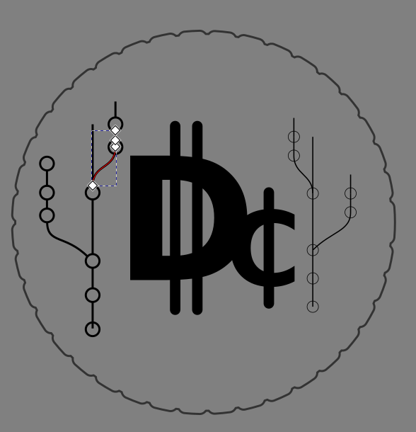
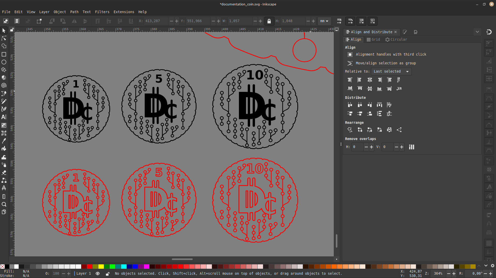

# 🪙 Skjalamynt (Documentation Coin)

!!! info
    Enþá verið að skrásetja.

Til að hvetja hópinn til að til að skjalfesta var búinn til gjaldeyri sem heitir "Til að hvetja hópinn til að til að skjallfesta var búinn til gjaldeyri sem heitir "Documentation Coin"Documentation Coin"

**Verkefni:** Skjalamynt (Documentation Coin)  
**Markmið:** Að hvetja þátttakendur í FLI Bootcamp 2025 til að skrásetja verkefni sín.

Skjalamyntin er hönnuð sem einföld en sjónræn hvatning:  
Myntin sýnir „commit“ mynstur úr Git og táknar skref í skjalfestingu verkefna. Hún er útbúin sem ** SVG skrá**, eingöngu úr línum svo hægt sé að **skera hana út með leysiskera** hratt, við notum color maping svo það sé hægt að skera þunt lag til að merkja og yrti línuna er hægt að skera alveg í gegn. Hægt er að skera hana úr hvaða efnivið sem er. 

Myntin kemur í mismunandi verðmati:
- `1` D¢
- `5` D¢
- `10`D¢

Þátttakendur geta unnið sér inn slíka mynt með því að skjalfesta verkefni sín vel og sýna fram á skilning á ferlinu.

Git commit = 1 D¢i
Random Merge conflict = 2 D¢

Þetta er skemmtileg leið til að:
- Viðurkenna framlag í skjalfestingu
- Vekja athygli á mikilvægi hennar í Fab Lab starfi
- Skapa söfnunar- eða umbunarkerfi innan hópsins

Hönnunar skrár eru aðgengileg hér:

- [.svg 1_5_10_dc.svg]()
- [PDF 20x1_dc.pdf]()
- [PDF 20x5_dc.pdf]()
- [PDF 20x10_dc.pdf]()

