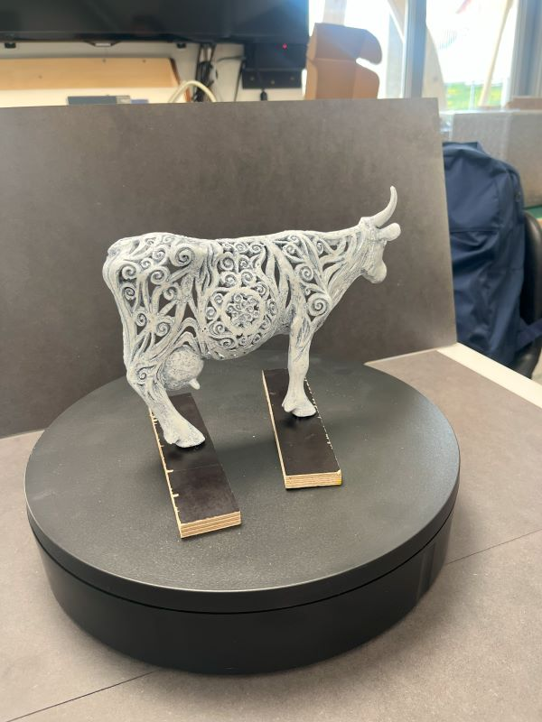
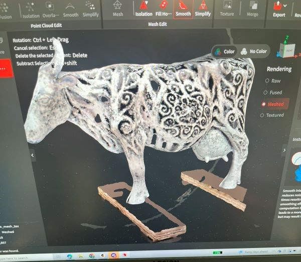
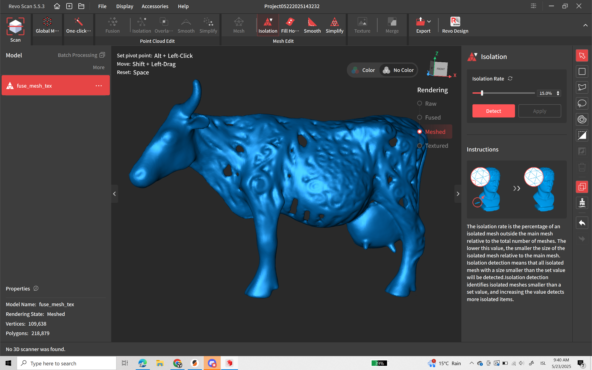

Eddan 3D skönnun.

Hvernig er hægt að skanna hlut sem á að hafa fullt af götum?
  
  

Þetta er eitthvað sem við ætlum að reyna að leysa.
Við erum búin að prufa að nota Revopoint frá Fab Lab Selfoss og þau komu einnig með ljósabúnað til að hjálpa til, fyrri hlutinn tókst vel í skönnum og tækið las það vel.

Hér er hlekkur á skannan sem við notuðum
https://www.revopoint3d.com/pages/all-in-one-3d-scanner-miracoplus

  

En þegar það var sett í prentunarformat kom í ljós að það sem við héldum að væru göt í skönnun voru eingöngu skuggar í ljósmyndaformatinu.

Hér er hlekkur á forritið sem við notuðum 

https://www.revopoint3d.com/pages/support-download?srsltid=AfmBOor7oZN-WOEwGp5Ti3WRNTO4v_bBXjjeiurKYbuAd1tIIGRgZd2o

  

  En svo prufuðum við að nota app sem heitir... frá Fab Lab Austurland og er það myndaapp sem er sett upp í snjalltæki.
  Vantar myndir og hlekk frá Ólöfu
    myndir af því

  Hvað svo?....
