# Saumavél

Ólöf vann að verkefni í Fab Academy og prófaði sig áfram með ,,Extension" í Inskscape sem kallast Inkstitch. Hún teiknaði mynd af hákarli og prófaði sig áfram með þá teikningu. Hún notaði einnig logo til að sjá hvernig hægt væri að nota ,,Offset" svo útlína væri ekki saumuð yfir fyllingu. Hér eru útskýringar á verkferlinu.

## Brother 6-nála útsaumsvél

!!! info "Bæklingur fyrir Brother 6-nála útsaumsvél"
    
    Fab Lab Húsavík á Brother 6-6-nála útsaumsvél. Hér er [bæklingur](https://download.brother.com/welcome/doch102285/884t23_om01en.pdf) fyrir Brother 6-6-nála útsaumsvélina. 

!!! tip "Dropi af olíu áður en unnið er með vélina"
    
     Það er mikilvægt að setja dropa af olíu á krókinn áður en neðri tvinninn er settur í.

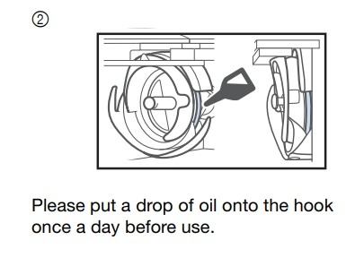

!!! info "Niðurhal og leiðbeiningar"
    
    Hægt er að sækja Inkstitch extension [hér](https://inkstitch.org/docs/install/). 
    
    [Hér](https://www.brother-usa.com/products/pr680w?srsltid=AfmBOooVz6D1Qg1xH7Wp5b3vJmmYAfjZst4mKufn2EUSffsu4XYdvi7v) má finna fleiri upplýsingar og leiðbeiningar um vélina.

!!! info "Að útbúa mynd fyrir saumavélina"
    
     Byrjaðu á að opna Inkscape. Fylgdu svo leiðbeiningunum [hér](https://www.flr.is/_files/ugd/0ebced_1bd42ec7d77140aea1e74aec7377078f.pdf) í bók eftir Hafey Hallgrímsdóttur um hvernig eigi að búa til límmiða (fyrsta verkefnið í bókinni). Fylgdu öllum leiðbeiningum þar til þú hefur búið til vektor teikningu.

     Ég notaði pennateikningu sem ég gerði en það er líka hægt að nota myndir af netinu.
     
     Næst smellir þú á **Hlutur** og svo **Fylling og útlína**, kveiktu á **Fyllingu** og slökktu á **Lit útlínu**.
     
     Þú getur valið liti hér en þú munt svo stilla litina endanlega í útsaumsvélinni.

     Smelltu á **Skrá** og **Skráareiginleikar**. Þar smellir þú á lítinn hnapp merktan **Aðlaga stærð að innihaldi**.

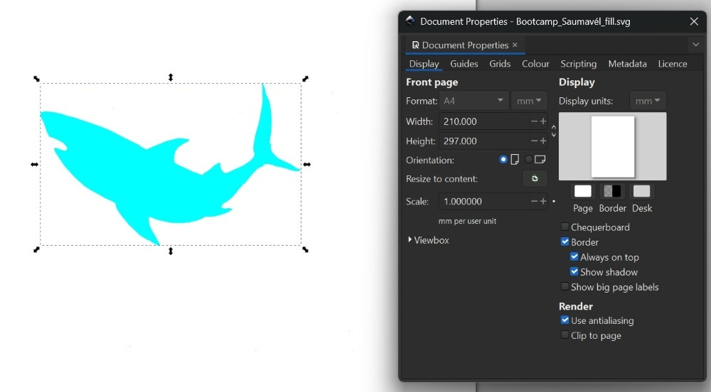

!!! info "Búið að aðlaga stærð að innihaldi"
    
     Eftir að stærðin hefur verið aðlöguð að innihaldi sést að blaðsíðan passar akkúrat utan um verkefnið.

!!! info "Að skoða stillingar í params"
    
    Ef þú smellir á **Extensions**, **Ink/Stitch**, **Params** getur þú skoðað stillingarnar fyrir útsauminn.

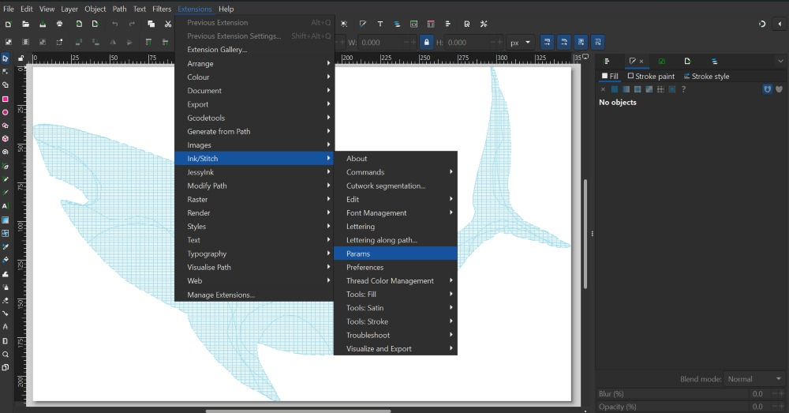

!!! info "Stillingar og forskoðun í params"
    
    Í params er meðal annars að finna forskoðun á útsaumsverkinu. Það spilast eins og myndband svo það sést hvernig útsaumurinn fer fram. Þarna er líka hægt að breyta ýmsum stillingum.

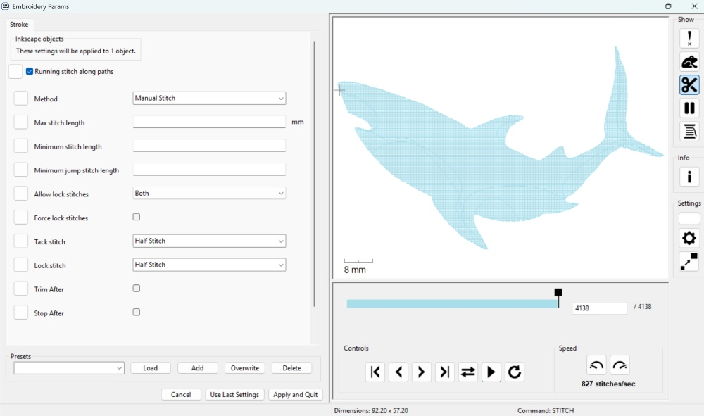

!!! info ".pes skrá býr til feril fyrir saumavél"
    
    Á myndinni hér fyrir neðan sést hvernig .pes hefur búið til feril fyrir útsaumsvélina. Þarna sést hvernig tvinninn verður lagður niður.

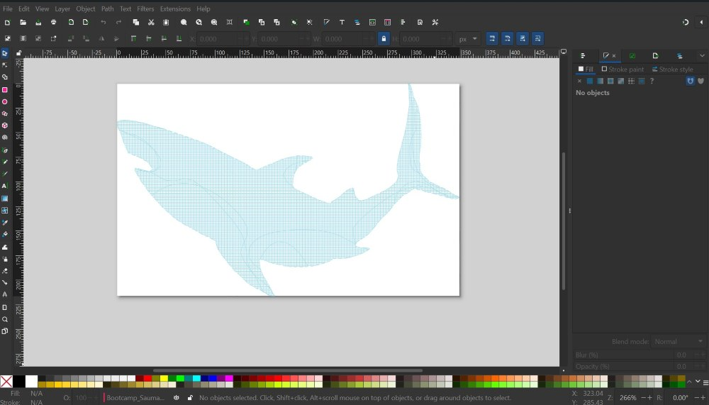

### Unnið með línur

!!! info "Að búa til útlínumynd fyrir útsaumsvélina"
    
     Ef þú vilt búa til útlínumynd getur þú fylgt leiðbeiningunum [hér](https://www.flr.is/_files/ugd/0ebced_1bd42ec7d77140aea1e74aec7377078f.pdf) í bókinni eftir Hafey Hallgrímsdóttur um hvernig eigi að búa til límmiða en þegar þú hefur smellt á **Hlutur** og **Fylling og útlína**, slökkt á **Fylling** og kveikt á **Litur útlínu**....þá, í stað þess að stilla **Stíll útlínu** á 0.02 gerir þú línuna þykkari. Það er gott a miða við að hafa línuna að lágmarki 1.5. Svo getur þú valið lit á línuna en þær stillingar eru svo endanlega gerðar í útsaumsvélinni síðar.

 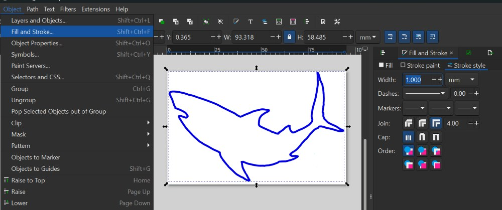  

!!! info "Að nota Convert line to Satin"
    
     Næsta skref er að smella á **Extensions**, **Ink/Stitch**, **Tools: satin** og svo **Convert line to satin**.

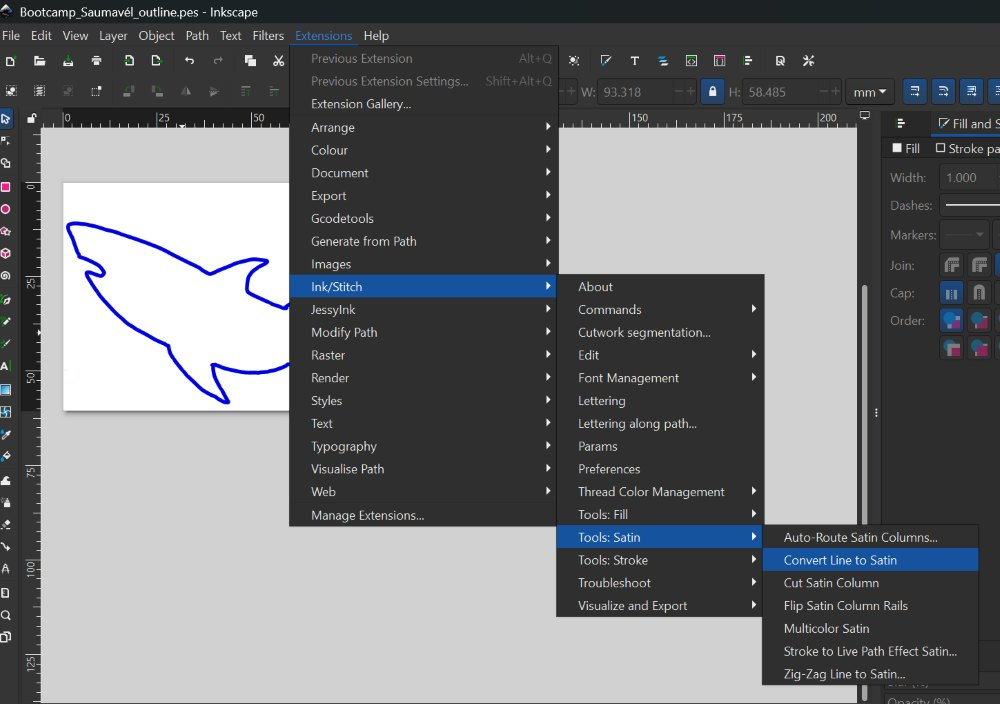

!!! info "að vista sem .pes file"
    
    Næst er skráin vistuð sem **.svg** skrá. Þessa skrá er hægt að nota síðar ef það reynist þörf á að breyta hönuninni. Svo er skráin vistuð sem **.pes file**. 
    

!!! info ".pes skrá býr til útsaumsferilinn"
    
    Á myndinni hér fyrir neðans sést hvernig .pes skráin bjó til feril fyrir þetta verkefni. Þráðurinn sést vel.

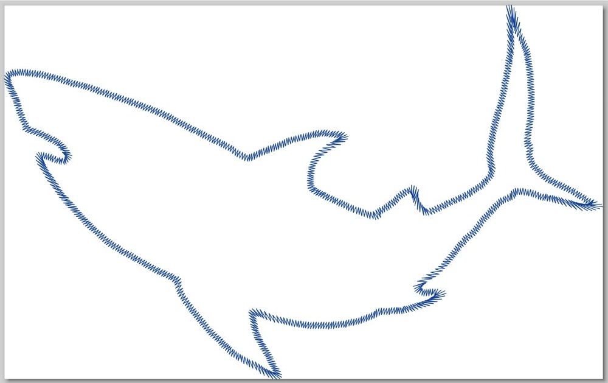

!!! info "Að festa efnið"
    
    Margnota taupoki var notaður í þetta verkefni. Efnið var fest í sérstakan útsaumsramma. Innri hluti útsaumsrammans var lagður innan í taupokann. Svo var bútur af stuðningsefni lagður ofan á rammann, semsagt einnig inni í pokanum. Það er mikilvægt að búturinn af stuðningsefninu sé nógu stór til að geta fallið á milli innri rammans og ytri rammans. Eftir að búið er að stilla af staðsetninguna á innri rammanum+stuðningsefninu er ytri ramminn lagður ofan á efnið og honum þrýst niður þannig að hann falli utan um innri rammann sem er hinum megin við efnið. Svo er skrúfan hert til að halda efninu á sínum stað. Þess er gætt að efnið sé nógu vel strekkt til að hægt sé að banka létt á efnið eins og trommu.

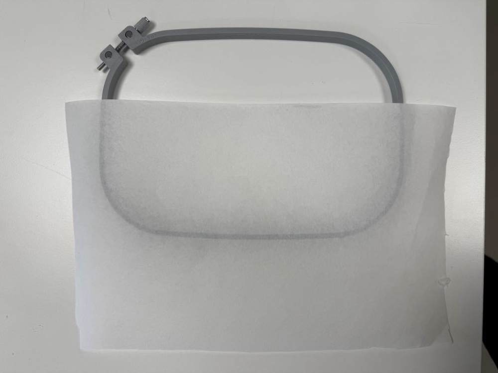

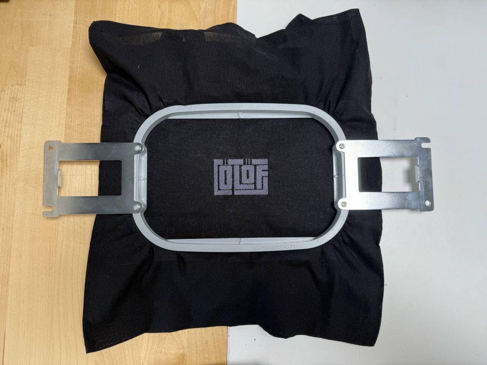

!!! tip "Röðun á lögum ræður röðun á útsaumi"
    
    Þegar unnið er með fleiri en einn litaflöt og línur í Inkscape verða til nokkur lög (e. layers) í Inkscape. Það er hægt að stýra því á hvaða litafleti vélin byrjar. Vélin byrjar ávallt á því lagi sem er neðst á listanum í Inkscape og fylgir svo lögunum uppávið. Þetta þýðir að þú getur breytt röðun laganna ef það skiptir máli í hvaða röð saumað er. Dragðu bara lögin til þar til röðunin er eins og óskað er eftir.

!!! info "Að nota Offset"
    
     Þegar ég byrjaði að skrá þetta niður mundi ég ekki hvernig ætti að hópa bókstafi saman á réttan hátt til að geta notað svokallað **Dynamic offset**. Ég fann svar frá einstaklingi, Lazur að nafni, við spurningu á [Inkscape forum](https://alpha.inkscape.org/vectors/www.inkscapeforum.com/viewtopic93da.html?t=15368). Svarið er annað í röðinni ofan frá.

     Lazur segir að það sé hægt að nota flýtileiðir. Eftirfarandi skrefum er fylgt:

     - Ýttu á **Shift+Ctrl+C** til að breyta texta í feril

     - Ýttu á **Shift+Ctrl+G** til að ferlarnir verði saman í hópi

     - Ýttu á **Ctrl+K** til að sameina ferla

     Sérðu pínulitla, bláa demantinn/tígulinn ofarlega í hönnuninni á myndinni hér fyrir neðan? Nú er hægt að grípa hann og draga hann til þannig að hönnunin minnki öll eða stækki (offset).

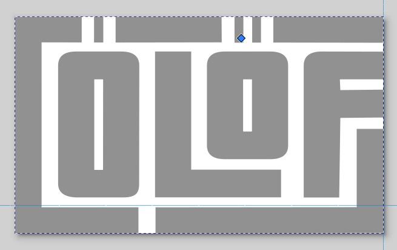

!!! tip "Flýtileiðir í Inkscape"
    
     [Hér](https://inkscape.org/doc/keys091.html) er að finna lista yfir allar flýtileiðir í Inkscape.

!!! info "Að jafna og dreifa"
    
     Ýttu á **Shift+Ctrl+G** til að ná öllum útlínuformunum saman í hóp. Veldu svo öll form í skjalinu með því að vinstrismella á músina og draga hana yfir allt. Svo er smellt á **Hlutur** og svo **Jafna og dreifa**.

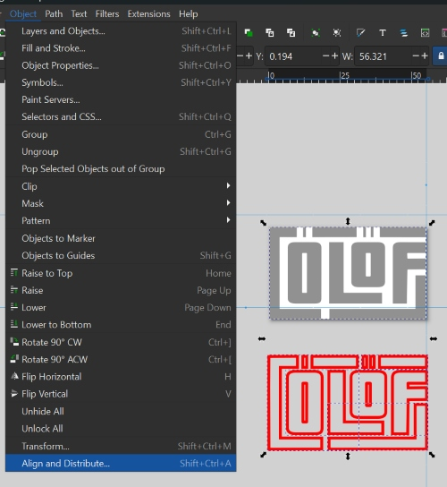

!!! info "Jöfnun og dreifing framkvæmd"
    
     Svo er smellt á táknin fyrir það að jafna á x-ás og y-ás. Þá er búið að staðsetja þau jafnt saman.

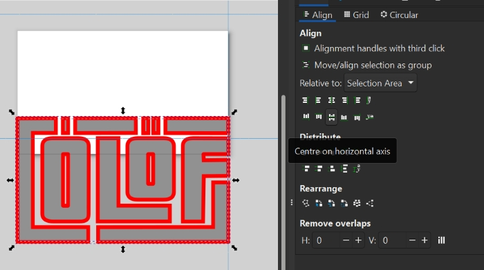

!!! info "Útsaumur tilbúinn"
    
     Svona leit verkefnið út eftir að vélin saumaði það út. Athugið að það er hægt að nota misþykkar útlínur í svona verkefnum, allt eftir smekk hvers og eins.

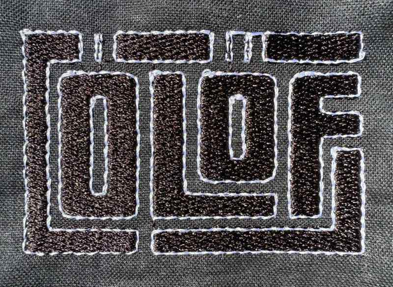

## English

Ólöf experimented with her fabacademy project with the embdoidery machine and learned about inkstitch. She prepared a Logo which was stitched 3 times with 3 different settings regarding outline, pattern fill and colour swatches. Here are directions on how to prepare a file for embroidering.

## Brother 6-needle embroidery machine

!!! info "Brochure for Brother 6-needle embroidery machine"
    
    Fab Lab Húsavík has a Brother 6-needle embroidery machine. Here is the [brochure](https://download.brother.com/welcome/doch102285/884t23_om01en.pdf) for the Brother 6-needle embroidery machine. 

!!! tip "A drop of oil before each use"
    
     It is important to put a drop of oil onto the hook before inserting the bobbin case. This has to be done each day that the machine will be used.

!!! info "Download and instructions"
    
    The Inkstitch extension can be downloaded from [here](https://inkstitch.org/docs/install/). 
    
    [Here](https://www.brother-usa.com/products/pr680w?srsltid=AfmBOooVz6D1Qg1xH7Wp5b3vJmmYAfjZst4mKufn2EUSffsu4XYdvi7v) you can find instructions on how to use the machine.

!!! info "Creating a image for the embroidery machine"
    
     To begin with you open the Inkscape program. Then you can follow the directions [here](https://www.flr.is/_files/ugd/0ebced_1bd42ec7d77140aea1e74aec7377078f.pdf) in a book by Hafey Hallgrímsdóttir on how to create a sticker (the first project in the book). You follow all steps until you have converted an image to a vector drawing. 

     I used a pen drawing that I made but you can also use images from the internet.
     
     Next you click on **Object** and then **Fill and stroke**, turn **Fill** on and turn off **Stroke paint**.
     
     You can either choose a colour for the image there or later, in the embroidery machine.

     Click on **File** and **Document properties**. Then you can see a small button for resizing the page to content.

!!! info "Resizing to content"
    
     Now you can see that the page fits around your design.

!!! info "Looking into params"
    
    If you click on **Extensions**, **Ink/Stitch**, **Params** you can look into the settings for the embroidery.

!!! info "Settings and preview params"
    
    In params you can see a preview of the path that will be embroidered. You can also adjust settings.

!!! info "A .pes file generates the sewing path"
    
    In the image below you can see how the .pes file has generated a path for the embroidery machine. You can see how the thread will be laid down.

### Image with only lines

!!! info "Creating a image for the embroidery machine"
    
     If you want to design an image where you are only using lines, you can follow the directions [here](https://www.flr.is/_files/ugd/0ebced_1bd42ec7d77140aea1e74aec7377078f.pdf) in the book by Hafey Hallgrímsdóttir on how to create a sticker but when you have clicked on **Object** and then **Fill and stroke**, turned **Fill** off and turned on **Stroke paint**....then instead of setting the stroke style to 0.02 you make the line thicker, f.ex. 1.0. Then you can either choose a colour for the image there or later, in the embroidery machine.

   

!!! info "Converting line to satin"
    
     The next step is to click on **Extensions**, **Ink/Stitch**, **Tools: satin** and then **Convert line to satin**.

!!! info "Saving as a .pes file"
    
    The next step is to save the file as a **.pes file**. You can choose any colour for the fill in the file and then you can change the colours when adjusting settings in the embroidery machine. 
    

!!! info "A .pes file generates the sewing path"
    
    In the image below you can see how the .pes file has generated a path for the embroidery machine. You can see how the thread will be laid down.

!!! info "Fastening the material"
    
    In this project a reusable bag was used. The material was fastened in an embroidery frame. The inner frame frame was placed inside the reusable bag and on top of it, also inside the bag, a  stabilizing backing was placed. It is important to make sure that the stabilizing backing is a bit bigger than the frame so that it can fit between the inner frame and the outer frame. After adjusting the placement of the inner frame + the stabilizing backing, the outer frame is placed on top of the reusable bag and pressed down until the frames fit together. Then the screw is tightened to keep the material in place.

!!! tip "Arranging the layers"
    
    You can control which layer is stitched first and which layers follow. The machine always begins with the layer at the bottom on the list of layers in Inkscape and then follows the layers upwards. This means that you can arrange the layers if the order of the layers matters. Just drag the layers to arrange them to your preferred setup.

!!! info "Offsetting"
    
     When I started to document this, I could not remember how to group the letters in the right way to be able to use a function called **Dynamic offset**. I found an answer by Lazur to a question in the [Inkscape forum](https://alpha.inkscape.org/vectors/www.inkscapeforum.com/viewtopic93da.html?t=15368). It is second in line from the top.

     Lazur says that you can use shortcuts. First you can use **Object to path** on a text to turn it into a group of paths. Then you do the following:

     - Press **Shift+Ctrl+C** to convert text to path

     - Press **Shift+Ctrl+G** to group

     - Press **Ctrl+K** to combine paths

     Can you see the tiny, blue diamond handle at the top of the bounding box in the image below? You can now grab it and resize (offset) the whole design.

!!! tip "Shortcuts in Inkscape"
    
     [Here](https://inkscape.org/doc/keys091.html) you can find a list of all shortcuts in Inkscape.

!!! info "Aligning fill and outline"
    
     The outline forms grouped the outline forms together by pressing **Shift+Ctrl+G**. Then I left-clicked on my mouse and dragged over both designs to select all. Then I clicked on **Object** and then **Align and distribute**.

!!! info "Aligning done"
    
     Then you click on the symbols for aligning on the x-axis and the y-axis. Then the two forms will be aligned.

!!! info "Embroidery ready"
    
     This is what the fill and outline looks like after embroidering. The thickness of the line in a design like this can be adjusted.

### Experimenting

Sarah and Alissa tried and failed mission, preparing inkspace file for seeing text in inkstitch. Troubleshoot on written Name in Inkspace when simulating the graphic and text, onlz the logo graphic was visible for stitching simulation/preview.

Ólöf helped us in finding out how to save the svg and pes files for checking the text ifit appears, but that unfortunately did not work. Yout Tube video gave us the hint about inkspace lettering, worked for us to place the text and see it simulated, but did not work to get the right colour and design as prepared beforehands on inkspace. Now, we figured it out, so it will be stitched with the text and the temporary logo for the Textíllab.

Pictures are following.

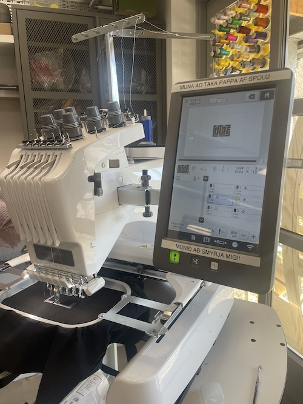
