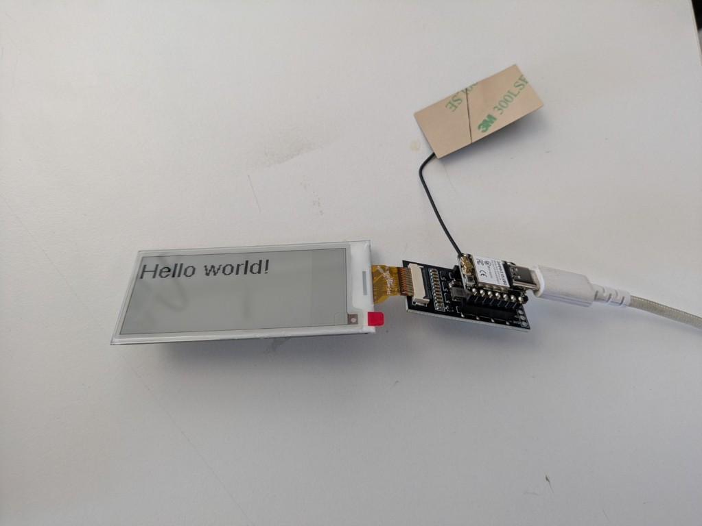
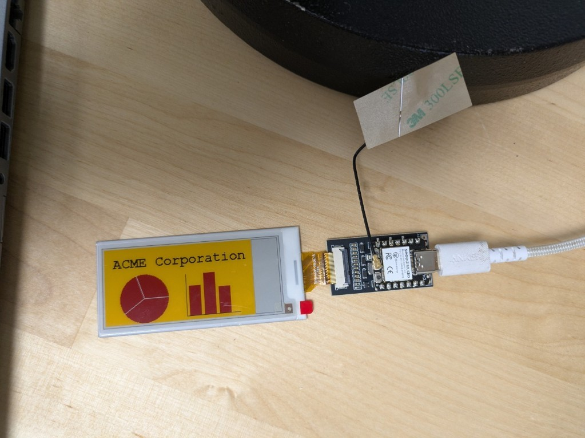

# XIAO e-ink

## Samsetning og uppsetning

https://www.seeedstudio.com/ePaper-Breakout-Board-p-5804.html?srsltid=AfmBOooWFwOP91tbiupUyrSihRJH6IivIsEKYREK-0oHQdlyqL3ighMd

https://www.seeedstudio.com/2-9-Quadruple-Color-ePaper-Display-with-128x296-Pixels-p-5783.html

https://www.hackster.io/etolocka/how-to-use-a-4-color-epaper-with-gxepd2-and-xiao-0e95a2

Setja upp: GxEPD2 í Arduino IDE

## Prufukóðar

### Prufa 1

```c++
// Include the GxEPD2 libraries
#include <GxEPD2_4C.h>

// Include font for the text
#include <Fonts/FreeSans9pt7b.h>

// Define pins for the Seeed Studio adapter board
    const int EINK_BUSY = D5;   // D5
    const int EINK_RST = D0;   // D0
    const int EINK_DC = D3;   // D3
    const int EINK_CS = D1;   // D1
    const int EINK_SCK = D8;  // D8 (SCK)
    const int EINK_MOSI = D10;  // D10 (MOSI)

// Create display object
GxEPD2_4C<GxEPD2_213c_GDEY0213F51, GxEPD2_213c_GDEY0213F51::HEIGHT>
display(GxEPD2_213c_GDEY0213F51(EINK_CS, EINK_DC, EINK_RST, EINK_BUSY));

void setup() {

    // Initialize the e-paper
    display.init(115200);
    display.setFullWindow();
    display.fillScreen(GxEPD_WHITE);
    display.setRotation(1);
    
    // Initialize text parameters
    display.setTextColor(GxEPD_BLACK);
    display.setTextSize(2);
    display.setFont(&FreeSans9pt7b);

    // Print text
    display.setCursor(0, 30);
    display.print ("Hello world!");

    // Update ePaper
    display.display ();
}

void loop() {
// Does nothing
}
```


///caption
Hello world!
///

### Prufa 2

```c++
// Include the necessary libraries
#include <GxEPD2_4C.h>

// Include the font definitions
#include <Fonts/FreeMonoBold12pt7b.h>


// Pin definitions for Seeed Studio adapter board
const int EINK_BUSY = D5;    // D5
const int EINK_RST  = D0;    // D0
const int EINK_DC   = D3;    // D3
const int EINK_CS   = D1;    // D1
const int EINK_SCK  = D8;    // D8 (SCK)
const int EINK_MOSI = D10;   // D10 (MOSI)


// Create the object associated with the display
GxEPD2_4C<GxEPD2_213c_GDEY0213F51, GxEPD2_213c_GDEY0213F51::HEIGHT> display(
  GxEPD2_213c_GDEY0213F51(EINK_CS, EINK_DC, EINK_RST, EINK_BUSY)
);

void setup() 
{
  // Initialize the epaper
  display.init(115200);
  display.setFullWindow();
  display.fillScreen(GxEPD_WHITE);
  display.setRotation(1);
  
  display.setTextSize(1);
  
  // Clear the screen
  display.setFullWindow();

  display.fillScreen(GxEPD_YELLOW); // Yellow background

  // 1. Pie chart
    
  // Define the center and radius of the circle
  int centerX = 65;
  int centerY = 80;
  int radius = 40; 

  // Draw the filled red circle
  display.fillCircle(centerX, centerY, radius, GxEPD_RED);

  // Calculate the angles for the chart sections
  float angle1 = 0;
  float angle2 = 144; // 40% of 360 degrees (0.4 * 360)
  float angle3 = 252; // 144 + 108 (30% of 360 degrees)

  // Convert degrees to radians
  float angle1_rad = angle1 * PI / 180;
  float angle2_rad = angle2 * PI / 180;
  float angle3_rad = angle3 * PI / 180;

  // Calculate the coordinates of the points on the circle's edge
  int x1 = centerX + radius * cos(angle1_rad);
  int y1 = centerY + radius * sin(angle1_rad);

  int x2 = centerX + radius * cos(angle2_rad);
  int y2 = centerY + radius * sin(angle2_rad);

  int x3 = centerX + radius * cos(angle3_rad);
  int y3 = centerY + radius * sin(angle3_rad);

  // Draw lines from the center to the edge
  display.drawLine(centerX, centerY, x1, y1, GxEPD_WHITE);
  display.drawLine(centerX, centerY, x2, y2, GxEPD_WHITE);
  display.drawLine(centerX, centerY, x3, y3, GxEPD_WHITE);

  // 2. Bar chart

  int originX = 135;  // X of the coordinate origin
  int originY = 115;  // Y of the coordinate origin
  int barW = 20;      // Width of the bars
  int barGap = 5;     // Gap between bars
  int barH1 = 50;     // Height of bar1
  int barH2 = 70;     // Height of bar2
  int barH3 = 45;     // Height of bar3

  // Draw the X and Y axes
  display.drawLine(originX, originY, originX + 90, originY,    GxEPD_BLACK);
  display.drawLine(originX, originY, originX, originY - 70,  GxEPD_BLACK);

  // Draw the bars
  display.fillRect(originX + barGap,           originY - barH1, barW, barH1, GxEPD_RED);
  display.fillRect(originX + 2 * barGap + barW, originY - barH2, barW, barH2, GxEPD_RED);
  display.fillRect(originX + 3 * barGap + 2 * barW, originY - barH3, barW, barH3, GxEPD_RED);

  // 3. Title text
    
  // Text configuration
  display.setTextColor(GxEPD_BLACK);
  display.setCursor(15, 20);
  display.setFont(&FreeMonoBold12pt7b); 

  // Print text
  display.print("ACME Corporation");

  // Refresh screen
  display.display();
}

void loop() {
  // Does nothing
}
```


ACME

### Að velja réttan skjá

Í kóðanum hér að ofan er notast við annan skjá en ég er með hér, önnur upplausn gerir það að verkum að hann nýtist ekki allur. 

TODO: Finna út úr því =)